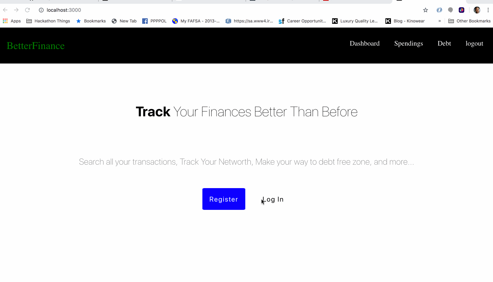

# Better_Finance

The purspose of this application is to better someones finances. Using the Plaid API the app can retrieve a users personal finance records with their bank insitution(s). The dashboard shows all of the transactions this person has made in the pass 30 days. The spending page shows the type of categories this perons has made purchases towards and can place a budget for all of the categories. The debt page shows the users debt and can calcualate how long it is going to take the user to become debt free.

## Getting Started

These instructions will get you a copy of the project up and running on your local machine for development and testing purposes. 

1. Clone this project to your local machine 
2. On the terminal travel to your folder where this project resides and type in the command "npm install"
3. On the terminal type in the command "npm run dev" - where it starts up the react script and the node script concurrently 
4. On your browser go type in "localhost:300" and Wallah welcome to Better Finance.

## Video Walkthrough

Here's a walkthrough 

GIF created with [LiceCap](http://www.cockos.com/licecap/).

### Prerequisites

What things you need to install the software and how to install them

1. Make sure you have node installed globally in your local machine - https://www.taniarascia.com/how-to-install-and-use-node-js-and-npm-mac-and-windows/

## Built With

* [React.js](https://reactjs.org/) - The web framework used
* [Node.js / Express.js](https://expressjs.com) - Server framework used
* [Mongodb / mLab ](https://mlab.com/) - Database management used

## Dependencies Used 
* [jsonwebtoken](https://jwt.io/)
* [jwt-decode](https://www.npmjs.com/package/jwt-decode)
* [moment](https://www.npmjs.com/package/moment)
* [plaid](https://www.npmjs.com/package/plaid)
* [axios](https://www.npmjs.com/package/axios)
* [bcryptjs](https://www.npmjs.com/package/bcryptjs)
* [concurrently](https://www.npmjs.com/package/concurrently)
* [config](https://www.npmjs.com/package/config)
* [joi](https://www.npmjs.com/package/joi)

## Author

* **Sparky Evangelista** - *Initial work* - (https://github.com/Sparkadelic177)

